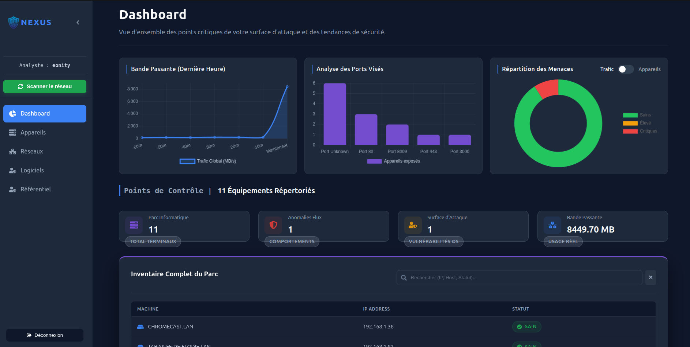
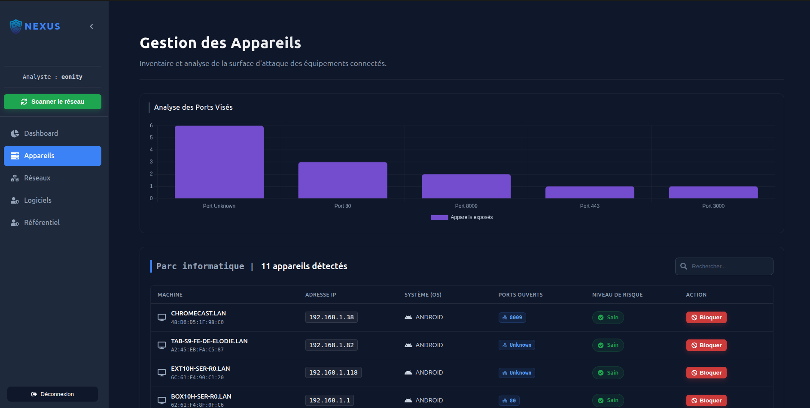
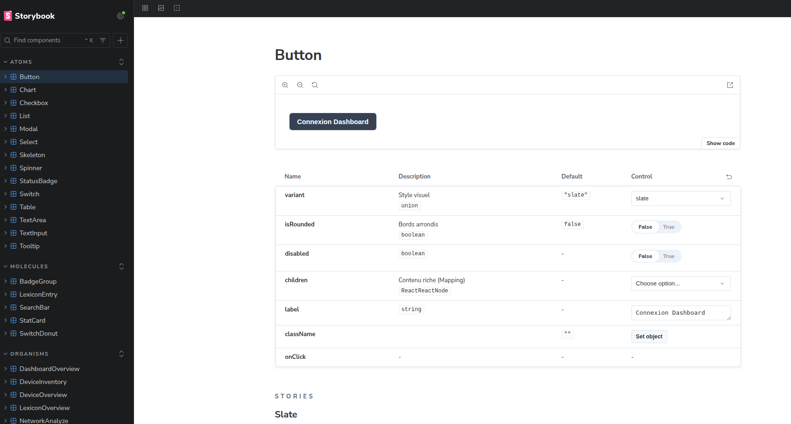
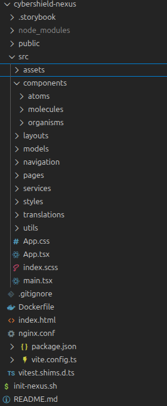
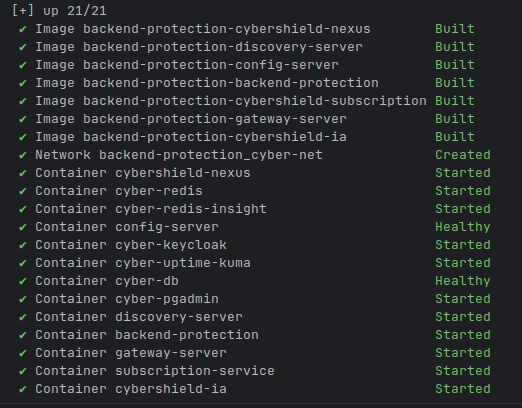
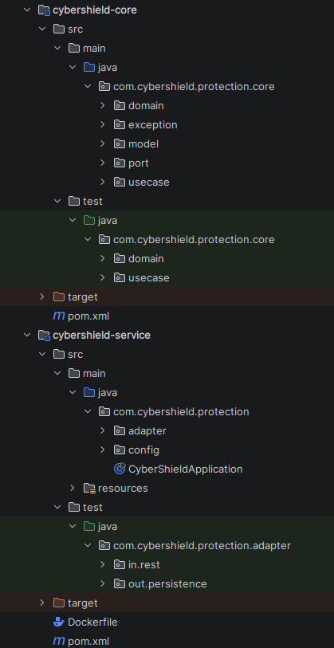
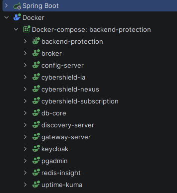
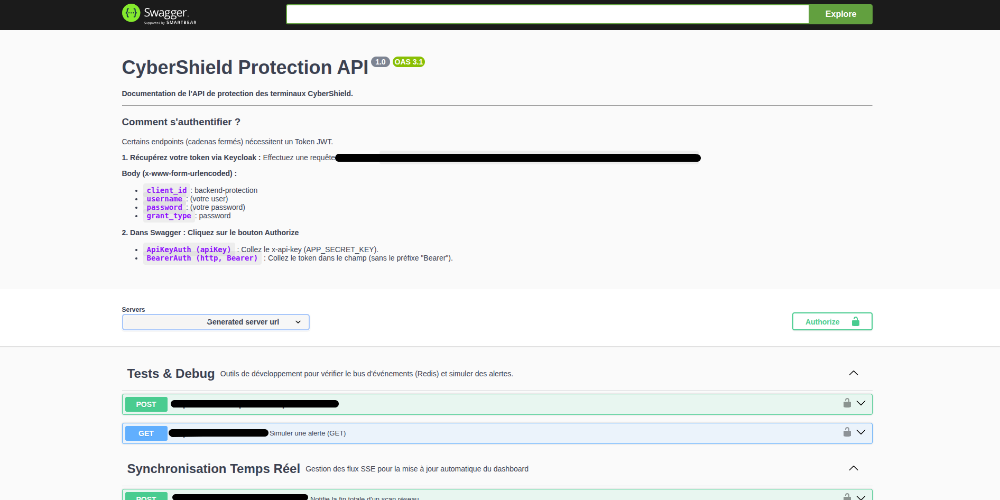
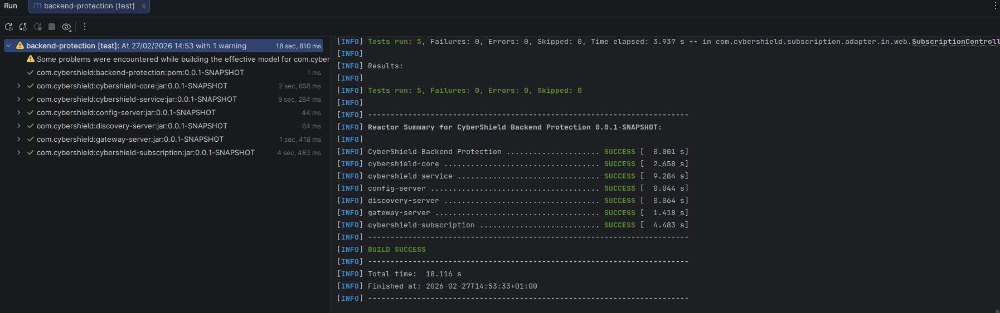

# CyberShield-360 | EDR & XDR Enterprise Platform

**CyberShield-360** est une solution complète de détection et de réponse aux incidents (EDR/XDR) développée de A à Z. Elle associe un Agent Python local, un Backend Microservices robuste en Java, et une interface SOC (Security Operations Center) en temps réel.

---

### Fonctionnalités Clés (Features)

_Pour des raisons de propriété intellectuelle, le code source complet de cette architecture est privé._ Ce dépôt fait office de **vitrine technique** pour présenter l'architecture, les fonctionnalités et les choix d'ingénierie du projet. Je serais ravi de réaliser une démonstration en direct et une revue de code détaillée lors d'un entretien.

- **Agent EDR Python (Cyber-IA) :** Déployé sur les terminaux. Utilise `scapy`, `nmap` et `psutil` pour le fingerprinting, l'analyse du trafic et la détection d'anomalies.
- **Temps Réel (SSE) :** Remontée des alertes critiques instantanément vers le dashboard SOC via Server-Sent Events.
- **Remédiation Active (Isolation) :** Capacité pour le DSI de bloquer/isoler une machine compromise du réseau d'un simple clic depuis l'interface web.
- **Dashboard Analytique :** Visualisation de la surface d'attaque (ports exposés), des niveaux de risques (Sain, Élevé, Critique) et gestion des politiques de sécurité.

## FRONT - INTERFACE ANALYSE SOC (React)

Développé en **React avec la méthode Atomic Design** et documenté via **Storybook**. L'interface ("NEXUS") est conçue pour l'efficacité opérationnelle des analystes sécurité.

### Gestion du Parc Informatique & Remédiation

Le dashboard permet de visualiser en temps réel l'état des machines (OS, IP, Ports ouverts) et d'appliquer une isolation réseau immédiate en cas de compromission (Bouton "Bloquer").

### Classification des Menaces (Threat Intelligence)

Moteur de classification interactif des menaces et normes cyber (Legal, Critical Threats, Identity & Access...) basé sur une base de données de conformité dynamique.

### Storybook (Atelier de développement front)

Une interface utilisateur/expérience utilisateur qui facilite la cohérence des designs entre les différents composants, en développant des composants **conformes aux normes** de design définies par **l'équipe UI/UX**,

### Atomic Design

Découpage rigoureux de l'interface en composants isolés et réutilisables (Atomes, Molécules, Organismes) pour garantir une maintenabilité optimale du code front-end et une scalabilité du projet.

## **ARCHITECTURE BACKEND & INFRASTRUCTURE**

Le backend est conçu pour la haute disponibilité et la scalabilité, en utilisant une architecture orientée **Microservices** et gérée intégralement sous **Docker**.

### 1. Infrastructure Dockerisée

L'ensemble de la stack est orchestré via Docker Compose, incluant les microservices, Keycloak, PostgreSQL, Redis et Uptime Kuma pour le monitoring.

- **Services Core :** Gateway, Discovery Server (Eureka), Config Server.
- **Business Logic :** `backend-protection`, `cybershield-subscription`.
- **IAM & Data :** Keycloak (Authentification OIDC), PostgreSQL, Redis.
- **Monitoring :** Uptime Kuma.

### 2. Architecture Hexagonale (Ports & Adapters)

Le service principal de protection a été codé en respectant strictement l'**Architecture Hexagonale (Clean Architecture)**.
Cette conception permet une séparation totale entre la logique métier (Core/Domain) et les détails techniques (API REST, Base de données).

- **`core` :** Contient le Modèle (`domain`), les `usecase` et les Interfaces (`port` In/Out). Zéro dépendance à Spring Boot.
- **`service / adapter` :** Implémente les contrôleurs REST (`in.rest`) et les accès à PostgreSQL (`out.persistence`).

### 3. Documentation (Swagger)

**Pour les développeurs** et uniquement en Dev : Il permet directement de faire la documentation à partir du code.

## 4. Qualité du Code & Tests Automatisés

La fiabilité étant un enjeu critique pour une plateforme de cybersécurité, le backend Spring Boot est couvert par une stratégie de tests rigoureuse garantissant la non-régression du code :

- **Tests Unitaires (JUnit 5 & Mockito) :** Validation isolée de la logique métier complexe (le `Core` de l'architecture hexagonale). Utilisation de **Mockito** pour simuler (mocker) le comportement des bases de données et des événements système, assurant des tests rapides et ciblés.
- **Tests d'Intégration (Spring Boot Test) :** Vérification des flux de bout en bout. Utilisation des annotations `@SpringBootTest` et `@WebMvcTest` pour valider le bon fonctionnement des API REST, la sécurité (filtres Keycloak) et l'intégration avec la couche de persistance PostgreSQL.

## **EXTRAITS DE CODE (Code Snippets)**

Pour avoir un aperçu de mes standards de code (Clean Code, Typage, SOLID), voici quelques extraits isolés du projet :

- **[Voir Le DeviceRepository](deviceRepository)**
- **[Voir un UseCase Java (Logique de blocage d'un Device)](useCaseDevice)**
- **[Voir un Test unitaire (Device)](testUnitaire)**
- **[Voir un Composant React (Atomic Design)](composant)**
- **[Voir le scan de l'Agent Python](ia)**

---

### Prêt pour une démo ?

Vous recrutez ? Ce projet n'est qu'un aperçu de ma capacité à concevoir des architectures full-stack complexes et sécurisées. N'hésitez pas à me contacter pour planifier une démonstration en direct.

**[LinkedIn](https://www.linkedin.com/in/yoann-martinez83)** |
**[CV en ligne - Yoann Martinez](https://yoannmartinez.fr/)** |
**[CV Papier](https://yoannmartinez.fr/plugin/files/cvYoannMartinez.pdf)**
